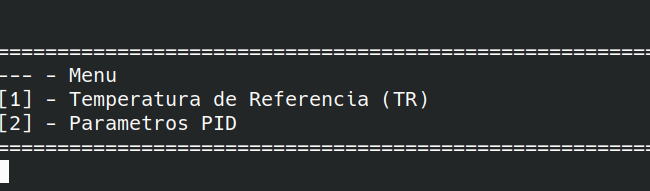
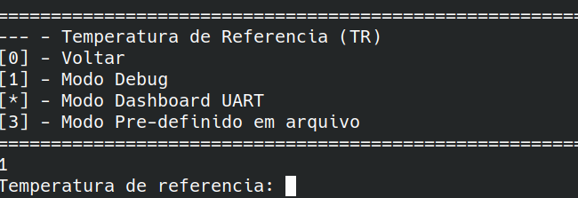
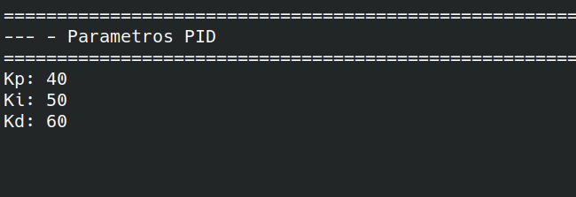
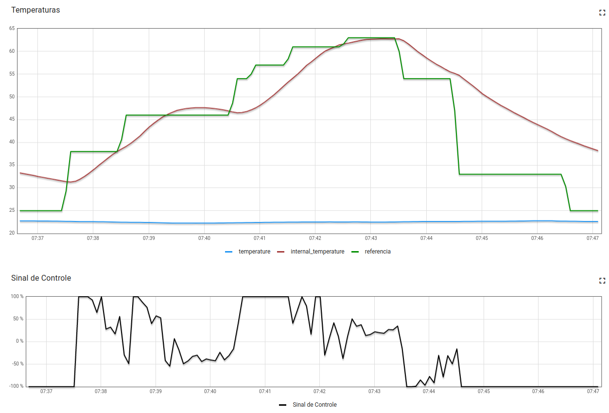

# Tabalho 2 - Fundamentos de Sistemas Embarcados 2022/2 - [Forno](https://gitlab.com/fse_fga/trabalhos-2022_2/trabalho-2-2022-2)

|Matrícula | Aluno |
| :--: | :--: |
| 190020377 |  Thiago Paiva |

## 1. Objetivos
Este trabalho tem por objetivo a implementação de um sistema (que simula) o controle de um forno para soldagem de placas de circuito impresso (PCBs). Abaixo vemos alguns exemplos de fornos comerciais para este propósito.

## 2. Interface

<hr>
<hr>
<hr>

## 2. Graficos

### 2.1 Modo Arquivo
<hr>

## 2.1 Log

<a href="https://docs.google.com/spreadsheets/d/e/2PACX-1vSq3S0MTHNiEddf3GZ5x1s9eE5zoeeFYsfhmD39m5vdhodXQwftgy9K9pJHCCC7sT8tXizdtPZ1hnqZ/pubchart?oid=600350178&amp;format=interactive" target="_blank">

</a>

<a href="https://docs.google.com/spreadsheets/d/e/2PACX-1vSq3S0MTHNiEddf3GZ5x1s9eE5zoeeFYsfhmD39m5vdhodXQwftgy9K9pJHCCC7sT8tXizdtPZ1hnqZ/pubchart?oid=891476578&amp;format=interactive" target="_blank">

</a>

## 4. Uso

```
$ make run
```

## 5. Apresentação

[](https://www.youtube.com/watch?v=tI3mUkDKjH4)
